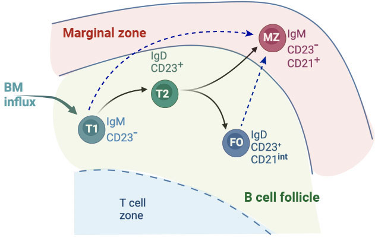

class: center, inverse

# .center[B cell ecology]

<hr>

<br>

--

## How are different B cell subsets maintained over time? 

--

<br>

## What are the pathways of B cell differentiation? 


???
I will focus on Fm B cells ... they emerge from Tr cells. quant. aspects of the lineage transitions and branchppoints are still unclear. 

 ### .center[Very little is known about the quantitative aspects B cell homeostasis]
 
 is T1 T2 source for FMS? are they homog?
how long do they reside for on average? 

- ### Do the rules of their turnover and replacement change with age? 

---

class: top, center
## Development of B lymphocytes
<hr>


```{r echo=FALSE, fig.retina=3, out.width='80%'}


```


???

Parallels between B and T cell development

Pro - Pre - selection and division - Immature B cells exit to periphery

End of the world post apocalyptic scenario
you are an engineer and the fate of the world depends on how you make this one weapon that selectively neutralizes the aliens invading our planet

???

---

## B cell maturation in the spleen
<hr>

- B cells transition through **short-lived** developmental stages in the spleen.


- Late-stage transitional (T2) B cells bifurcate into fully mature Follicular (FO) or Marginal Zone (MZ) B cells.

<br>


```{r echo=FALSE, fig.retina=3, out.width='60%'}

knitr::include_graphics("figures/bcell_matu.jpg")
```

---

## Division of labour and space
<hr>

<!---
#### Division of labour within B cells
--->

<h4 style="color:#006789; font-size:100%"> 
Marginal Zone is an anatomical barrier that divides lymphocyte-rich follicles and the erythrocyte-rich red pulp.
</h4>

.pull-left[
```{r echo=FALSE, fig.retina=3, out.width='100%'}

knitr::include_graphics("figures/MZ_viz1.jpg")
```

.right[*Zimber-Strobl group* 
<p style="font-size:90%; color:#595959;">Lechner et al Nat Comm 2021 </p>
]

]

???
5 % of circulation goes through spleen
blood cicrulation opens into marginal sinus where blood slows down so that Mphages and B cells guarding the sinus can filter it for antigens/pathogens.

--

.pull-right[


- FO B cells typically respond to antigens presented by Dendritic cells and Macrophages in a **T cell dependent manner** and produce high-affinity antibodies.
{{content}}

]


???

MZ B cells are strategically positions to locate pathogens that breach systemic barrier and emerge in blood.

--


- MZ B cells are strategically positioned to identify and respond to **blood-borne** antigens. 
<h4 style="color:#9e423c;">&#8658; Gatekeepers of the immune system.</h4>


---

## .center[Complete replacement within FO B cell pool]

.middle[
```{r echo=FALSE, fig.retina=3, out.width="90%", out.height="90%"}


```
]


???
- minor and gradual increase in cell counts

- Complete replacement --> homogeneous 

- donor Ki67 looks higher- suggests host and donor not acting in same way - so how can it be homog?

We again to Maths to reconcile these obs./ anomalies

---

class: center, middle

## FO B cells turn over more slowly with host age

```{r echo=FALSE, fig.retina=3, out.width='90%'}


```

???
inter div time for both donor and host is SAME! booth rarley divide most of the ki67 is inherited.

This naturally explains there host; donor diffs in Ki67 - NOT ANY INTRINSIC HOST/DONOR DIFFS - RATHER,  soon after BMT the donor cells in the FM pool have all recently entered from the T1 pool, who are rapidly dividing -  so will be transiently enriched for cell that inhertityed ki67. But over time as the population turns over, host and donor look same. And there is actually very  little division within FM cells. 

---
class: 

### Insights into FO B cell homeostasis
<hr>


- FO B cells divide **very rarely.**
  - Inter-division times &approx;  > 1 year (CI: 0.6-23)
  
  
--

<br>

- Their **life-expectancy** increases with mouse age.
  - Mean lifespan in a
    > 10 wk old mouse &approx;  35 days (CI: 2.5-4) </br>
    > 1 year old mouse &approx;  45 days </br>
    > 2 year old mouse &approx;  61 days


 
--

<br>

### FO B cells are a homogeneous, slowly dividing population whose lifespan increases with host age

???

inter div time for both donor and host is SAME! booth rarley divide most of the ki67 is inherited.

This naturally explains there host; donor diffs in Ki67 - NOT ANY INTRINSIC HOST/DONOR DIFFS - RATHER,  soon after BMT the donor cells in the FM pool have all recently entered from the T1 pool, who are rapidly dividing -  so will be transiently enriched for cell that inhertityed ki67. But over time as the population turns over, host and donor look same. And there is actually very  little division within FM cells. 

---

### Plasticity in B cell differentiation pathways
<hr>


<br>

```{r echo=FALSE, fig.retina=3, out.width='50%'}

knitr::include_graphics("figures/bcell_matu.jpg")
```

???

### BCR signalling strength is believed to be the deciding factor.
Strong signals drive differentiation into FO and weak signals lead to MZ fate. 
  
---
count: false

### Plasticity in B cell differentiation pathways
<hr>

<br>

```{r echo=FALSE, fig.retina=3, out.width='50%'}


```


- Fully mature follicular (FO) and very early stage transitional (T1) B cells can also  develop into MZ B cells depending on the **Notch2** signal availability.
.right[
##### Lechner *et al.* Nat Comm 2021
]

???

### Factors governing B cell fate-determination remain unknown.  


---
count: false

class: middle
<hr>

## How do B cells integrate Notch2 signals to determine cell-fate at steady states?

<hr>

---

### Cell fate determination in B cells
<hr>

- **Competition** for development?

  - Developing B cells compete for limiting concentration of Notch2 ligands.

--

- **Selection** across natural variation in Notch2 expression?
  - Natural variation in Notch2 signalling.
  
--
.center[
### `<< Insert answere here >>`
]


---

class: inverse
### What we learned about modelling?

<blockquote>
All models are wrong but some are useful.
.right[-- <cite>George Box</cite>]
</blockquote>

--

- Break the models by introducing system perturbations.

<br/>

--

### What we learned about lymphocyte biology?

- Life-expectancy of naive CD4 and CD8 T cells increases with their age.

- Naive CD8 T cells exhibit distinct dynamics in early life and adulthood.

- FO B cells are a homogeneous population whose lifespan increases with host age.

---
count: false
class: center

### Acknowledgements
<hr>

.pull-left[
#### University College London
Dr. Benedict Seddon </br>
Dr. Melissa Verheijen
]

.pull-right[
#### Helmholtz Zentrum München
Dr. Ursula Zimber-Strobl </br>
Dr. Lothar Strobl </br>
Tea Babushku
]


#### Columbia University
Dr. Andrew Yates

--


</br>

### A big thanks to **IICD** family!


```{r echo=FALSE, fig.retina=3, out.width="70%"}

```


---
count: false
class: center, middle

```{r echo=FALSE, fig.retina=3, out.height= '60%'}


```

# Thanks!

Slides were created in `html5` using [remark.js](https://remarkjs.com) and R packages [**knitr**](http://yihui.name/knitr) and [**xaringan**](https://github.com/yihui/xaringan).

