class: center;

### Temporal fate mapping: A window into lymphocyte dynamics
<hr>

### Immune chimerism using Bone marrow transplants in  mice


```{r echo=FALSE, fig.retina=3, out.width='80%'}

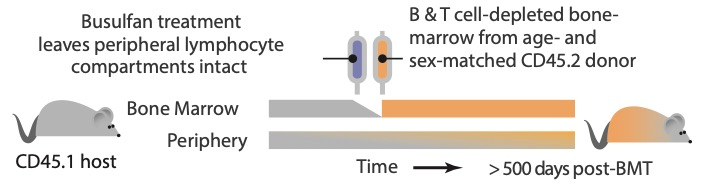
```

--

### Tracking  <span style="color:#9e423c;">invasion</span> of donor cells into the host compartments over time.


.right[
<p style="font-size:90%; color:#595959;">
Seddon lab UCL London
]

???
We have devised a novel exp strategy to temporally map cellular replacement in mice using this drug called busulfan.

now busulfan specifically targets actively dividing cells and kills them.
We have optimised a low dose of busulfan that targets HSCs while leaving the peripheral lymphocyte compartments intact.

then in these busulfan treated mice we transfer BM from congenic donors and track the donor and host cells over a year!!!!

---

### Dynamics of 4 crucial components of adaptive immune system

<hr>

1. **Naive CD4 T cells**

  - "Helper T cells" &rarr; provide instructive signals to other T cells and B cells.
  
--
  
2. **Naive CD8 T cells**

  -  "Killer T cells" &rarr; deliver cyto-toxic signals to pathogens and tumors.
  
--
  
3. **Follicular B cells**

  - "Conventional B cells" &rarr; secrete high-affinity antibodies.
  
--

4. **Marginal Zone B cells **

  - "Gatekeepers of the immune system" &rarr; eliminate blood-borne pathogens.
  

---
count: false

class: center, middle, inverse;

## What are the rules of naive T cell homeostasis?


---
class: center, middle;

### Dynamics of naive CD4 and CD8 T cells in adult busulfan chimeric mice

<hr>

</br>


```{r echo=FALSE, fig.retina=3, out.width='90%'}

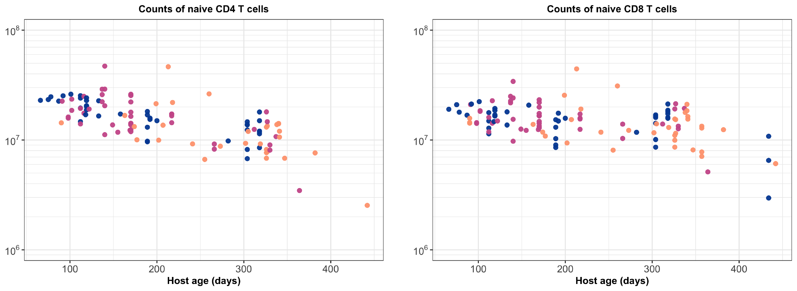
```

.right[
<p style="font-size:90%; color:#595959;">
Different colors indicate different ages when BMT was performed.
</p>
]

<hr>


---

### Niche sizes are aggregates of production and turnover
<hr>


.pull-left[

```{r echo=FALSE, fig.retina=3, out.width='120%'}

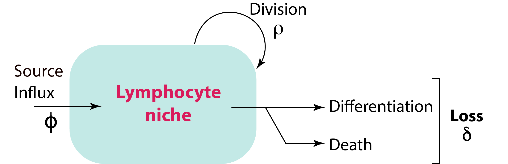
```

]

.pull-right[

.center[
<p style="font-size:90%"> 
Neutral model: constant rates
</p>


$$
\dot{N} = \phi \, P(t) + \rho \, N - \delta \, N
$$

$$
\dot{N} = \phi \, P(t) + \psi \, N 
$$
<p style="font-size:90%; color:#595959"> 
P: upstream precursor population.
</p>
]
]

--

<br>


$\psi$ is the net growth rate:  
 the propensity of a cell for division minus its propensity for loss $(\rho - \delta)$

--

<br>

#### The ability of a cell and its progeny to persist within the compartment over time — ‘Homeostatic fitness'.

<hr>

???
and we can express this mathematically in a simplest model like this ...

to simplify further... we can combine the cells ability to divide and turnover into one single parameter $\psi$.
Now e just have 2 parameters!!! Voila!
We're always looking to tie the maths to biological reality - you can interpret the inverse of phi as the average
lifetime of a clone, rather than a single cell.

---

class: center
### The kinetics of percolation of donor cells are rich in information

<hr>

</br>


```{r echo=FALSE, fig.retina=3, out.width='90%'}

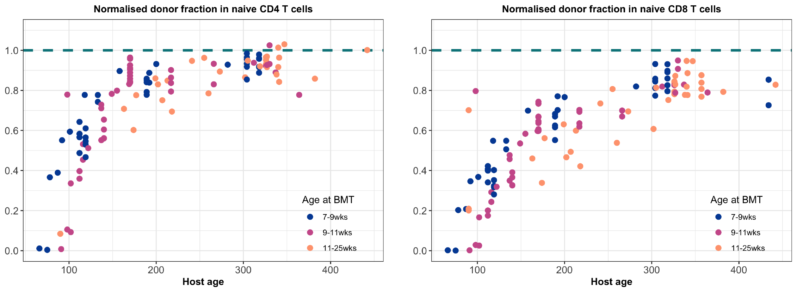
```

---
count:false

class: center
### The kinetics of percolation of donor cells are rich in information

<hr>

</br>


```{r echo=FALSE, fig.retina=3, out.width='90%'}

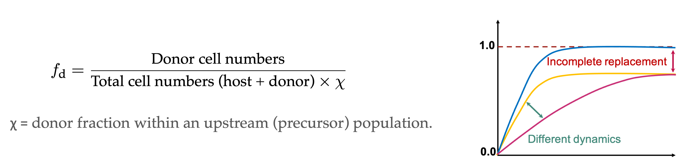
```


<p>
<span style="font-weight:bold">Set point – </span>  Whether replacement is complete or incomplete. </br>
<span style="color:#006789"> Heterogeneity within the compartment.</span>
</p>

<p>
<span style="font-weight:bold">Upslope – </span> How fast host cells are replaced by donor-BM-derived cells. </br>
<span style="color:#006789">  Driven by the rate of influx and growth. </span> 


---
### Untangling division and loss
<hr>


- $\small \text{Ki}67$ — a nuclear protein expressed during cell-division.</br>
&#8618; Independent handle on the rate of cell division.

--

- Lymphocytes continue to express Ki67 protein for &approx; 4 days after the division.
.right[
<span style="color:#606060; font-weight:900; font-size:90%;"> Hogan _et. al._, PNAS 2015</span>
]


```{r echo=FALSE, fig.retina=3, out.width='30%'}

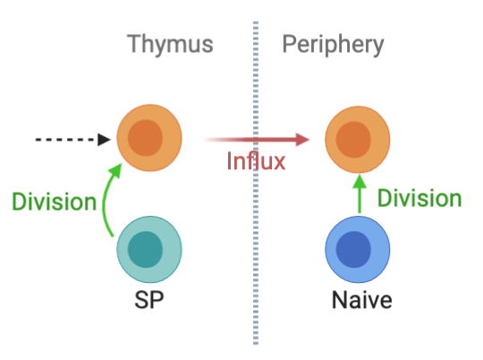
```


### Residual signal from development or homeostatic division in periphery?


<hr>

---

class: center
### Division history of naive T cells

<hr>

</br>


```{r echo=FALSE, fig.retina=3, out.width='90%'}

knitr::include_graphics("figures/Ki_data.png")
```


---


### Potential mechanisms of lymphocyte maintenance
<hr>

#### Quorum sensing

  > Competition for survival or self-renewal


```{r echo=FALSE, fig.retina=3,  out.width='45%'}

knitr::include_graphics("figures/QS_diag.png")
```

--

<br>

.shadedbox[
$$
\frac{dN}{dt} = \phi \, P(t) + \rho(N) \, N(t) - \delta(N) \, N(t)
$$
.center[P(t): Changes in counts of immediate precursor populations.]
]

---

<hr>

#### Kinetic heterogeneity
  
  > Two compartments with distinct rates of division and loss
  
```{r echo=FALSE, fig.retina=3,  out.width='45%'}

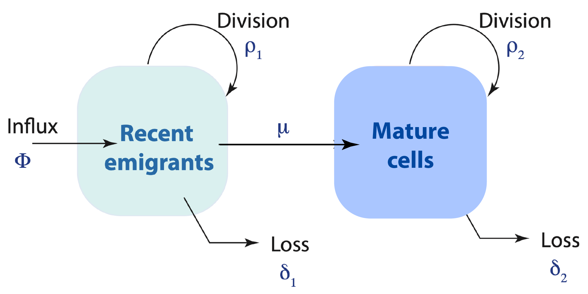
```

--

.shadedbox[
$$
\begin{aligned}
&\frac{dR}{dt} = \phi \, P(t) + \rho_1 \, N(t) - \delta_1 \, N(t) \\
&\frac{dM}{dt} = \mu \, R(t) + \rho_2 \, N(t) - \delta_2 \, N(t)
\end{aligned}
$$
]

<hr>

---

<hr>

#### Adaptation: Cell-age dependence
  
  > Ability to die or self-renew modifies with cell-age.
  
```{r echo=FALSE, fig.retina=3,  out.width='50%'}

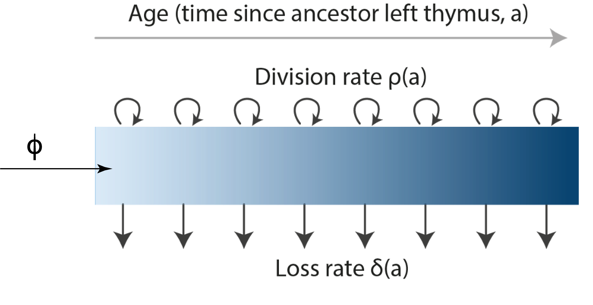
```

--

Naive T cells of age 'a' and Ki67 expression 'k' are tracked across time 't', by analytically solving a 3-dimensional PDE,

.shadedbox[
$$
\begin{aligned}
\frac{\partial N}{\partial t} + \frac{\partial N}{\partial a} - \beta \, k \, \frac{\partial N}{\partial k}= -(\rho(a) + \delta(a)) \, N(t, a, k)
\end{aligned}
$$
]

<hr>
---
count: false

class: center, middle, inverse

## How to select the best model?

---
class: center

### Model validation
<hr>

$$
\begin{aligned}
&y_i \sim \text{normal}(\mu_i, \sigma_i) \quad \quad \quad \quad \quad \quad  &[\text{likelihood}] \\
&\mu_i = M(\text{time}, \theta)  &[\text{model prediction}]\\
\end{aligned}
$$
$\theta:$ Vector of parameters within the model.

--


.shadedbox[
$$
\begin{aligned}
& \small \text{log(Total counts) } \Rightarrow \quad &y_1 \sim \text{normal}(\mu_1, \sigma_1)\\
& \small \text{logit(Normalised donor fraction) } \Rightarrow \quad &y_2 \sim \text{normal}(\mu_2, \sigma_2)
\end{aligned}
$$
]

--

<h3 style="font-size:140%; color:#9e423c;">  Prior  distributions are defined for model parameters &rarr;   &theta;'
</h3>

$$
\begin{aligned}
\text{For example, } \quad \quad
&\theta_1 \sim \text{uniform}(0.0, 1.0)  \\
&... \\
&\theta_n \sim \text{normal}(0.005, 0.01)  \\
\end{aligned}
$$


???

Each model was fitted simultaneously to the timecourses of $\small log(\text{counts})$   proportions of $\small logit(\text{Ki}67^{high})$ cells.


We form a joint likelihood which is the probability density of data across the parameter distribution $\theta$ by assuming that the errors are normally distributed. 

---

<hr>

### Our aim is to update prior beliefs in the model:  $\quad \theta'$ &rarr; $\hat\theta$


$$
P(\hat \theta | y_1, y_2) = \frac{P(y_1 | \hat \theta) \cdot P(y_2 | \hat \theta)  \cdot P(\theta')}{P(y_1) \cdot P(y_2) } 
$$
--

</br>

### Sampling the posterior:
Parameters are sampled from the joint density $P(\theta)$ using **Hamiltonian Monte Carlo** (H-MC) algorithm.

  - Models are coded in _Stan_ language and fitted using the **NUTS** sampler.
  - Posterior distributions and model fits are analyzed using _R_ package `rstan`. 
  
<hr>
???
Normalized product of probability densities of both datasets and the prior distribution of params.

- This probability density is then used to update our prior beliefs in model parameters using the bayesian approach.


We judge the models under consideration based on **parsimony** and their ability to predict **New observations** which is also called as out of sample prediction error.


.shadedbox2[
Occam's razor:
Models are selected based on **parsimony** and their ability to predict **New observations** &mdash; (out-of-sample prediction error).
]


---
### Estimate of **confidence** in the model
<hr>


### Leave-One-Out cross validation:

```{r echo=FALSE, fig.retina=3, out.width="40%"}

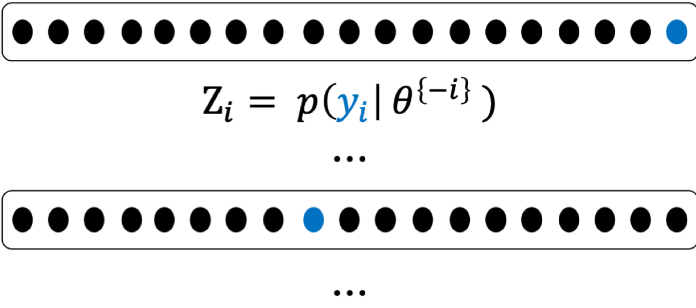
```


$$
\text{Leave-One-Out information criterion:} \,\,
\small \text{LooIC} = -2 \,\, \sum_{i=1}^n \, Z_i
$$

.center[
<h3 style="color:#9e423c; font-size:150%;">
&#8658; LooIC measures the model's ability to predict new data.
</h3>
]


.right[... continued]


???
We measure this  out of sample prediction error using Leave-One-Out cross validation, in which a single observation is treated as test dataset and rest of the observations are trated as training data. The process is repeated for all 'n' observations and the prediction error for each left-out test set is aggregated to calculate Leave-One-Out information criterion (LOOIC).


---
<hr>

### Scaling the models:

$$
\small \Delta \text{LooIC} = \text{LooIC}_i - \text{min}(\text{LooIC})
$$

  - $\small \Delta \text{LooIC} = 0 \Rightarrow$ Best-fit model. 
  - Higher values suggest poorer support from the data.

???
Only relative values of LooIC are meaningful

--

</br>

### Relative support:

<u>Analog of Akaike weight</u>

.shadedbox[
$$
\omega_i = \frac{\exp(-\frac{1}{2} \, [\Delta \text{LooIC}]_i)}{\sum_m^M  \, \exp(-\frac{1}{2} \, [\Delta \text{LooIC}]_m)}
$$
]

- Proportional statistical support among the models under consideration.

???
We then used the estimated LOO-IC values to assess the relative support for models using the analog of the Akaike weight which gives us the probability that a given model will explain new data better than other models considered in this analysis.


---
class: center, top

### Naive T cells **adapt** to persist longer in circulation
<hr>

```{r echo=FALSE, fig.retina=3, out.width='85%'}

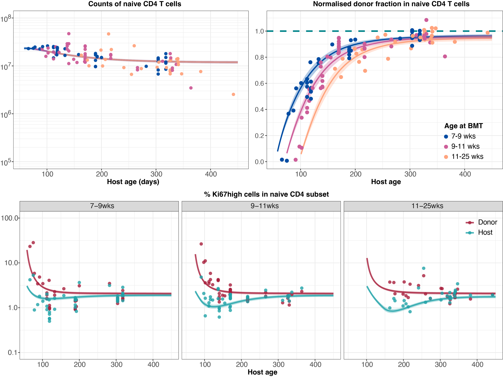
```


---
class: center, top

### Naive T cells **adapt** to persist longer in circulation
<hr>

```{r echo=FALSE, fig.retina=3, out.width='85%'}

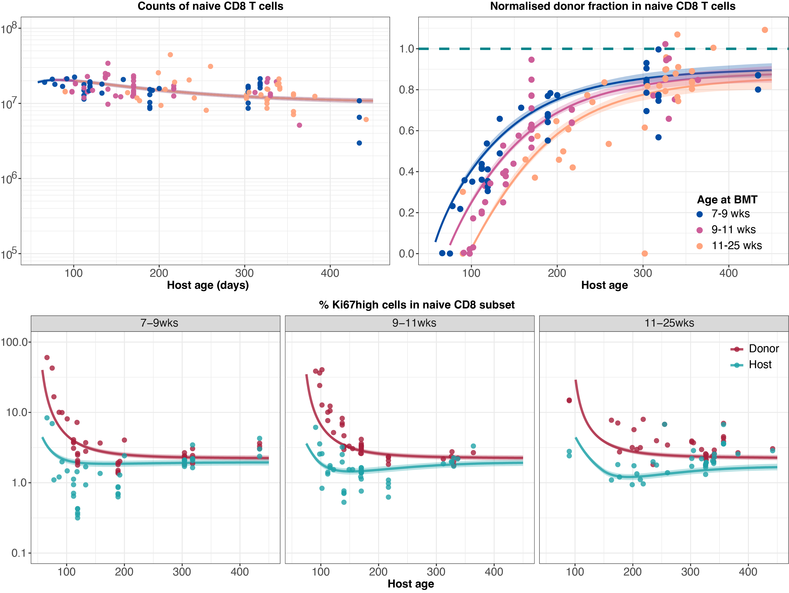
```


???


### Results

<hr>

using buchi data and statisical validation we found:

1. neutral and quorum sensing models could be rejected.

2. Equivocal support for Adaptation and selection models.

---

<hr>

### Next steps:

- We refined our models to pinpoint whether cell-age dependent effects manifest in either their rate of **loss** (&delta;) or their rate of **division** (&rho;)

--

- Equivocal support for age-dependent loss &delta;(a) and  age-dependent division &rho;(a) models.

--

<br>

### Uncertainty in model selection may arise from:

1. Sparsity in observations.

2. Batch effects and experimental variations.

3. Poorly defined models - Oversimplified or too complex.

<hr>
---

### How do we then select the best-fitting model?

--

- #### Assess the parameter estimates from each model.

> Non-physiological parameters may warrant reanalysis or optimization of model definitions. 

--

- #### Add more **relevant** data to fitting procedures. 

> Adding more steady-state data points may not influence the model behavior. </br>
> Break the models by testing them against systemic perturbations.

--

- #### Make out-of-sample predictions. 

> Assess models' ability to predict data generated in diverse experimental settings.


---
### Validating models using out-of-sample predictions approach
<hr>

```{r echo=FALSE, fig.retina=3, out.width='70%'}


```

```{r echo=FALSE, fig.retina=3, out.width='65%'}

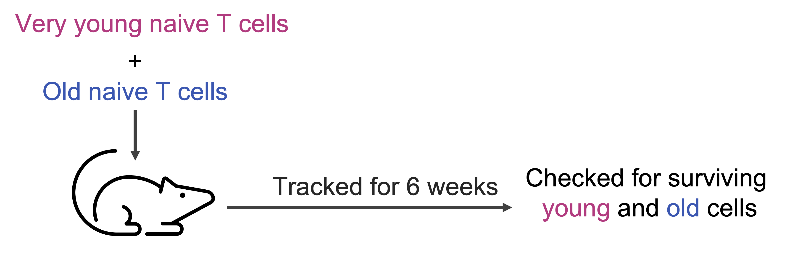
```

.right[
<p style="font-size:90%; color:#595959;">Houston et al. PNAS 2011</p>]

--

### We generated predictions of the survival kinetics of naive T cells using cell-age dependent models.


---
class: center

### Expected lifespan of naive CD4 and CD8 T cells increases with cell-age.
<hr>


Ratio of <span style='color:#B13B7F;'>young</span> and <span style='color:#3B57B1;'>old</span> cells

```{r echo=FALSE, fig.retina=3, out.width='55%'}

knitr::include_graphics("figures/houston_d.png")
```


<p style="font-size:120%; color:#9e423c;">
Age-dependent division &rho;(a) model failed to explain the survival kinetics of naive T cells.
</p>

---


### Predicting T cell dynamics in early life
<hr>

### Rag<sup>GFP</sup> Ki67<sup>RFP</sup> mouse model

- GFP is expressed in developmental stages in the Thymus and is turned off upon export to the peripheral lymphoid organs.

- T cells in periphery dilute GFP by,
> cellular ageing: exponential decline as GFP gets degraded within cells.
>
> cell-division: GFP is distributed equally between progeny.


---
class: center, top

### Out-of-sample predictions of naive T cell dynamics in early life

<hr>

```{r echo=FALSE, fig.retina=3, out.width='75%'}

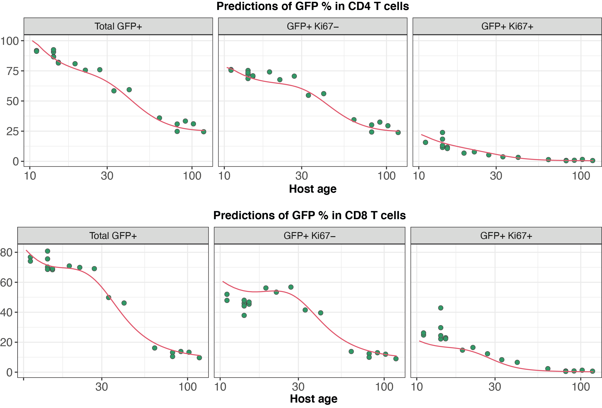
```


--

### Distinct dynamics of naive CD8 T cells in neonates and adults.

<hr>


---

class: center, middle

### Naive CD8 T cells are lost at a faster rate in neonates than in adults.

<hr>

```{r echo=FALSE, fig.retina=3, out.width='85%'}

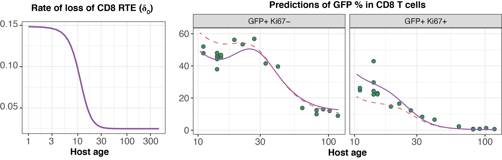
```


<br>

A simple out-of-sample prediction method reveled a very profound principle of naive CD8 T cell dynamics.


<hr>


???

---

class: center, middle

### The adaptation model provides the most parsimonious explanation of naive T cell maintenance
<hr>

<br>

```{css, echo = FALSE}
caption {
      color: #035AA6;
      font-weight: bold;
      font-size: 1.25em;
    }
```

```{r echo=FALSE, fig.retina=3}
## function for exporting a data table of delta loo ic values and akaike weights
#takes 2 separate lists of the name of the models and loo-ic values
library(kableExtra)
data_vec <- c("Cell counts in Wild Type mice",
              "Cell counts in Thymectomised mice",
              "Dynamics in Busulfan BM chimeras",
              "Kinetics of adoptively transferred cells",
              "Naive T cell acccumulation in early life",
              "Decline of in vivo labelled naive T cells",
              "Dynamics of newly made cells in neonates and adults")

df <- data.frame(
  "Dataset" = data_vec,
  "Neutral" = c("\u2714", "\u2717", "\u2717", "\u2717", "\u2717",  "\u2014", "\u2014"),
  "Competition" = c("\u2714", "\u2714", "\u2717", "\u2717", "\u2717",  "\u2717", "\u2014"),
  "Selection" = c("\u2714", "\u2714", "\u2714", "\u2717", "\u2014",  "\u2014", "\u2014"),
  "Adaptation" = c("\u2714", "\u2714", "\u2714", "\u2714", "\u2714",  "\u2714", "\u2714")
)

df %>%
  kable(caption = "Table: Summary of results", align = c('l', rep('c', 4))) %>%
  kable_styling(font_size = 15) %>%
  row_spec(3, color =  'darkblue', bold = TRUE)%>%
  column_spec(5, color =  'green', bold = TRUE)%>%
  column_spec(c(2,3, 4), color =  'darkred', bold = TRUE)

```

.right[
Rane _et. al._ Plos Bio 2018 and bioR&chi;iv 2022 
]
---

### Insights into naive T cell homeostasis
<hr>


1. Naive T cells **divide rarely**.
  
  - Inter-division times for:
  
    > -  CD4 T cells &approx; 18 mo (CI: 16-22)
    > -  CD8 T cells &approx; 14 mo (CI: 12-26)
  
--

2. Their **life-expectancy** increases with cell-age.
  
  - Mean lifespan of youngest cells:
  
    > - CD4 T cells &approx; 3 wk (CI: 2.5-4)
    > - CD8 T cells &approx; 3 mo (CI: 2.5-4.5)

  - Time taken for lifespan to double: 
   
    > - CD4 T cells &approx; 6 wk (CI: 5-7)
    > - CD8 T cells &approx; 5 mo (CI: 3.5-7)
    
    
<hr>
    
    
    
    
    
    
    
  
