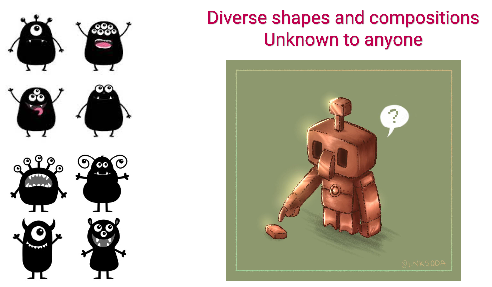

count: false
layout: false

<video autoplay width="100%" height="100%" controls id="my_video">
    <source src="figures/Presentation1.mp4" type="video/mp4">
</video>

???
Throughout our life the cells of our imunsystem protect us from the pathogens of multitudinal shapes and forms.

What are the precise rules these cells follow.

---

## .center[Peculiar problem]

<hr>

```{r echo=FALSE, fig.retina=3, out.width='90%'}


```


---
class: inverse
background-image: url("figures/inverse_bg.png")

### Three fundamental laws of Golemics:

- <h3 style="color:#fcba03; font-size:130%"> Unique and specific: </h3>
 
  - Each Golem uniquely identifies an unknown trait. 
 
  - Large army for countless possibilities.


--

- <h3 style="color:#fcba03; font-size:130%"> Aware of self:  </h3>
  
  - Each Golem must recognize our own.
  
  - Any that pose threat to earth inhabitants are removed instantly. 


--

- <h3 style="color:#fcba03; font-size:130%"> React, multiply and Remember: </h3>
  
  - Once an alien trait is identified react.
  
  - Make more copies of yourself.
  
  - Remember the trait to respond faster next time.


---
class: inverse, center, middle
background-image: url("figures/inverse_bg.png")

## .center[The Golems of our immune system]

```{r echo=FALSE, fig.retina=3, out.width='90%'}

knitr::include_graphics("figures/intro_eco.png")
```

---

## .center[T and B cells are cornerstones of adaptive immunity]
<hr>


### * Unique and Specific: 

- Repertoire of clones that identify proteins and lipids  &rarr; collectively called as **antigens**, that are expressed on pathogens and tumors.


- Each clone carries a unique receptor.
  > T cells express T cell receptor (TCR). </br>
  > B cells express antibody molecules (Ig).


- T and B cells that havent encountered antigen yet &rarr;  **Naive** cells.
  > Continuously circulate within lymphatic and blood circulation in search of "specific antigens".

---

<hr>


### * Aware of self: 

- Educated in the BM, thymus and spleen to identify self-antigens.

- Clones that `recognize` self are **selected positively.** 

- Clones that `recognize` and `react` are removed through **negative selection.**

--

<br>

.shadedbox2[

&#x1F4A1; **Interesting insight**

Over 95% newly made T cells and B cells are removed from  during their development by the processes of positive and negative selection.

This ensures that the lymphocytes entering our lymphatic and blood circulation are only specific to foreign and unknown antigens.
]  
  
---

### * React and Remember: 

- Effector response against pathogens and tumors by secreting Antibodies, Cytokines, Interferons etc.

--

- Proliferate massively to make more antigen specific clones.

--

- Transform into **memory** cells for future encounters.

--


<h3 style="color:#9e423c;">
A broad and long-lasting  T and B cell repertoires are crucial to protect against <strong>new</strong> and <strong>recurring</strong> infections throughout our lifetime.
</h3>

???
Maintaining the size and breadth of naive T cell repertoire is paramount in protecting us against new infections throughout our lifetime.

---

class: center, middle, inverse


## How are the numbers and clonal diversity of lymphocyte populations maintained throughout life?


