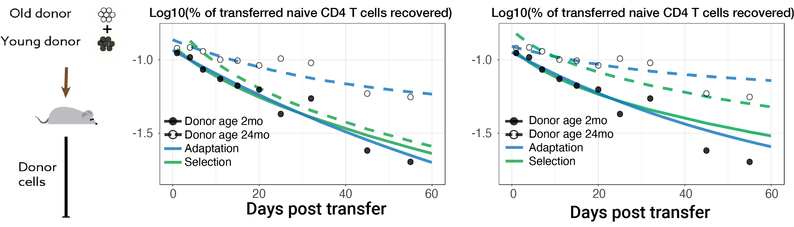

<br/>

<hr/>
### .center[Models depict our belifs about how world functions]
<hr/>

???
- We use models to describe our beliefs about how things work

The broad category of models can be identified based on how do we want to approach the problem
<hr>

--

#### To understand the processes that underlie the observed _biological_ pheneomeneon.
- Accounts for the factors at lower hierarchical levels within a system.

Molecules $\rightarrow$ Cells $\rightarrow$ Tissue $\rightarrow$ Organism $\rightarrow$ Population $\rightarrow$ ecosystem

???
whch focus on understanding the underlying processes and mechanisms that potentially explain given data.
they work on the factors at lower hierarchical levels within a system.
e.g. to understand pop dynamics of cell subset in a tissue we model the behavior of individual cells.


---

### Predictive model:
#### To explore possible outcomes in different conditions.

- Heavily focused on identifying trends within the data.

???
Heavily focussed on discovering trends within the data and predicting the system behavior in different conds.

--

#### __Whale sightings as the predictor for fishing expeditions__

```{r echo=FALSE, fig.retina=3, fig.width=8, fig.height=5, out.width='65%'}
set.seed(1456)

pred_vec <- function(x){0.15 * x + 4}
pred_dat <- rnorm(20, 1.2, 2) + pred_vec(seq(0, 25, length.out = 20))

ggplot() + 
  geom_point(aes(x = seq(0, 25, length.out = 20), y = pred_dat)) +
  geom_line(aes(x = seq(0, 25, length.out = 20), y = pred_vec(seq(0, 25, length.out = 20)))) +
  labs(x = 'Whale sightings', y= 'Succesful fishing expeditions') +
  theme_bw() + theme(legend.position = c(0.9, 0.9), legend.background = element_blank())

  
```

- #### A simple Linear regression between two events.

- #### Can be modified to account for other variables e.g. Seasonal variation.

---

### Dynamical models: Predator-Prey systems


```{r echo=FALSE, fig.retina=3, fig.width=8, fig.height=5, out.width='65%'}
require(deSolve)

ode_func <-  function(t, state, parms){
  with(as.list(c(state, parms)),{
    dx <- a * x - b * x * y 
    dy <- d * x * y - g* y
    list(c(dx, dy))
  })  # end with(as.list ...
}
params <- c('a' = 1.1, 'b' = 0.4, 'd' = 0.1, 'g' = 0.4)
state <- c(x = 10, y = 10)
ts_pred <- seq(0, 80, 1)
x_error <- rnorm(length(ts_pred), 1, 0.8)
y_error <- rnorm(length(ts_pred), 1, 0.8)

sol_ode <- data.frame(ode(y=state , times=seq(0, 80, 0.2), func = ode_func, parms = params))%>%
  rename('Prey' = x, 'Predator' = y)%>%
  gather(-time, key = key, value = Population)
  
ggplot(sol_ode) + 
  geom_line(aes(x = time, y = Population, col = key)) +
  theme_bw() + theme(legend.position = c(0.9, 0.9), legend.background = element_blank())
```
###### .right[*exponential growth and non-limiting food supply]


$$
\frac{dx}{dt} = \alpha \, x - \beta \, x  \quad \quad 
\frac{dy}{dt} = f \, \beta \, x - \gamma \, y\\
$$
###### .right[*Lotka-Volterra equation]
---


## .center[Aliens and the Golem]
<hr>

???
A thought experiment

--
Post apocalyptic scenario
Aliens have invaded the world and you are assigned with a job to create a weapon that can specifically identify aliens and destroy them.


???
So he asks his engineers to make a Golem, a brainless machine/monster, that can specifically identify foreign spies and destroy them.


<figure>
  
</figure>

--

The problem is No one knows how these aliens look. No evidence or data on the appearance or behavior.

So how would you to tackle this problem.

Fortunately you have read Assimov's iRobot and you come with three fundamental rules:


--

---

### Mechanistic models: 
Real world -- resource competition -- quaroum sensning
Density-dependence growth:

Cancer and immune interactions.

---
## .center[]
<hr/>

### Model design
#### Alternative hypotheses that potentially explain the observed phenomena.
???
different mechanisms that explain data

--

Formulate assumptions within each hypothesis as mathematical equations.
- Build **upwards and outwards** from the simplest model (_Nested models_).
- Parsimony: Be stingy with the use of unknown variables.

--

### Empirical validation
- Confront models with data $\rightarrow$ Update hypotheses
- More data derived from systemic perturbations $\rightarrow$ **Break the models**.

--

### Statistical validation
- Relative statistical support for each hypothesis within all the tested hypothesis.

<hr/>

???
The results must be presented in the context of only tested models.
A true model may lie outside of our test models, which may not be feasible at the moment to be tested.
---

How do we use mathematical models to understand the long-term dynamics of the cells of the immune system?

---


---

class: center

<hr>


#### Naive T cell dynamics in thymectomized mice

```{r echo=FALSE, fig.retina=3, out.width='75%'}

knitr::include_graphics("figures/Tx_res.png")
```

???
Equivocal evidence for adpata and fcfo model
 therefore we tested these models on more data. 
--

</br>


#### Kinetics of loss of adoptively transferred cells


```{r echo=FALSE, fig.retina=3, out.width='90%'}


```


<hr>

???
older cells recovered more in young hosts.
but this could be explained by selction, adptation or incumbent model --> as all 3 models lead to accumulation of fitter and older cells. 
modelling helps us to dissect these o

