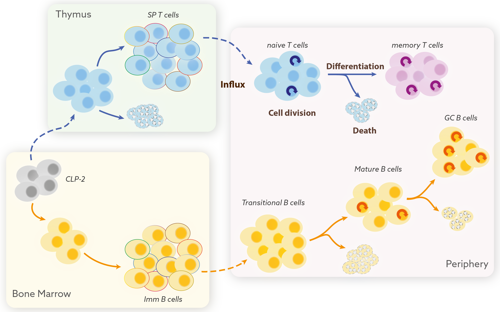
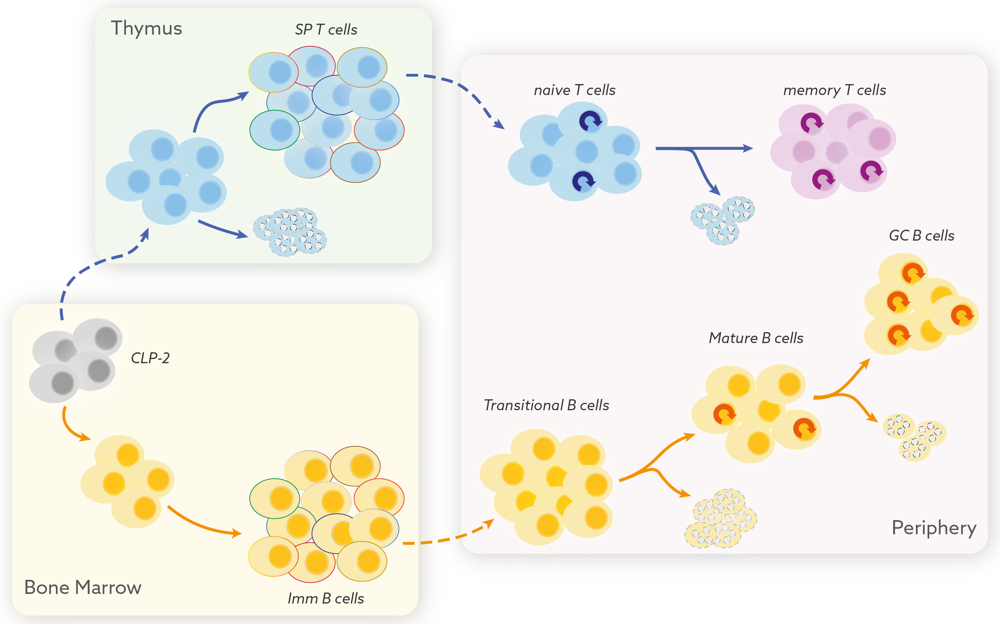

## .center[Dynamic ecosystem]

<hr>

```{r echo=FALSE, fig.retina=3}


```


???

Compartments shaped by constant influx of new specificities, loss of old ones…

- b and t cells with new specificities are continuously exported from BM and Thymus into the peripheral lymphoid organs as , which slowly mature into are basically young naive T cells.

- The clonal diversity and numbers of peripheral naive t cells are maintained by an aggregate effect of death, division and differentiation processes.

- In many ways it is an ecosystem - We need to quantify lymphocyte ecology to understand the development and maintenance of our immune repertoires.


<!---
## .center[Dynamic ecosystem]

<hr>


```{r echo=FALSE, fig.retina=3}


```

-->

---

## Regulations of clonal diversity
<hr>


<h3>
* Lymphocyte repertoires are
</h3> 

- augmented by flow of new cells from the bone marrow <span style="color:#035AA6;"> &#8594; enhances diversity.</span>

--
  
- sustained by proliferation (homeostatic self-renewal) <span style="color:#035AA6;"> &#8594;skews diversity</span>
  
--


- depleted by loss of cells (by death and onward differentiation).

--

<h3 style="color:#9e423c;">
Can we quantify all of these processes to understand how the repertoire is established and how it evolves over an individual’s lifespan?
</h3> 

---

### Complexity & Dynamism in lymphocyte homeostasis

<hr>


#### Multiple processes contribute to **establishment** and **maintenance**.  
</h3>

 - Division, death, influx from the precursor, onward differentiation etc.


```{r echo=FALSE, fig.retina=3, out.width='55%'}

knitr::include_graphics("figures/homeostasis_processes.png")
```


--


### Does the relative contribution of these processes vary across a lifetime?


---

### What happens with age?
<hr>

- #### Dynamic growth in early life
  
  - Newly generated lymphocytes quickly populate and adapt to rapidly developing tissues.
  
  - Naive T and B cell numbers change dramatically up to puberty in humans and age 7-8 weeks in mice.


--


- #### Stability in Adulthood
  - Numbers are maintained stably despite decline in production.
  - Is there compensatory increase in cell division or decrease in loss or both?
  
</br>


.right[
<p style="font-size:90%; color:#595959;">Verheijen et al. 2020, Rane et al. Plos Bio 2018,  </br> Duchamp et al. Imm Infl Dis 2014,  den Braber et al. Immunity 2012, Bains et al. JI 2009,  </p>
]

---
<hr>

### Potential mechanisms that may compensate decline in production

- **Quorum sensing**
> Cells compete for reources that are necessary for their persistence. </br>
> Decrease in population density triggers increased survival and division.

--

</br>

- **Adaptation**
> Cells adapt to survive longer and/or to divide better with their age. </br>
> Accumulation of <span style="color:#9e423c;">old </span> cells as we age.

--

</br>

- **Selection**
> Natural variation in cellular fitness. </br>
> Some clones persist longer than others and accumulate as we age.

---

### What are the rules of replacement within lymphocyte populations? 
<hr>

#### Is replacement purely stochastic? Hierarchy? 

???
- Random displacement? Hierarchy? 

--

-  First-in-first-out  &rarr; Conveyor belt?  

- First-in-**last**-out?

--

Identifying these rules impacts our understanding of lymphocyte maintenance


???

- Do new immigrants displace pre-existing cells or the relatively older cells have a 'homeostatic advantage'?


--


### &rArr; Are lymphocyte restoration therapies beneficial?
  - HSC transplant, lymphoablative procedures, Immunodeficiencies  and HIV patients

--

### &rArr; Does heightened vulnerability to infections and cancers with age stem from accumulation of <span style="color:#9e423c;"> old </span> and potentially <span style="color:#9e423c;"> incompetent </span> cells over time?


---
class: inverse
background-image: url("figures/inverse_bg.png")

## .center[Building unifying models of T and B cell life-histories]
<hr>

### In tightly knit interative connections with experimental data.  </br> 

--

To explain &mdash;

<h3 style="color:#fcba03; font-size:150%;">
&#8658; Dynamic establishment in neonates and stability in adults. 
</h3>

--

<h3 style="color:#fcba03; font-size:150%;">
&#8658; How and why does our immunity wanes with age?
</h3>

???
Do changes in the age-structure and diversity of naive T cells explain why our ability to fight new infections wanes with age?

--

<h3 style="color:#fcba03; font-size:150%;">
&#8658; Evolution of lymphocyte repertoires and  collapse in its diversity with age.
</h3>

???

<h3 style="color:#fcba03; font-size:150%;">
&#8658; Prediction of lymphocyte recovery in Stem cell transplant and HIV patients.

???
So, mostly through this work we want to study the Mechanisms that regulate T cell pool sizes and in turn their clonal diversity across our lifespans.
**A model that explains it all** &xrarr; 

- How cd4 and cd8 repertoire evolve and how different they are

--

### .center[A quantitative map of our immune competence.]

???
Our goal is to understand the deterministic processes behind naive T cell maintenance and then use it simulate how TCR repertoire diversity evolves using gillespie algorithm or agent based models.

Also knowledge of thse mechanisms will definitly help us to understand how T cell pools are reconstituted in HSC Transplants and in HIV patients

<!---
?Is there LIP? Does the extent of reconstitution depend on the age of individual?
--->


